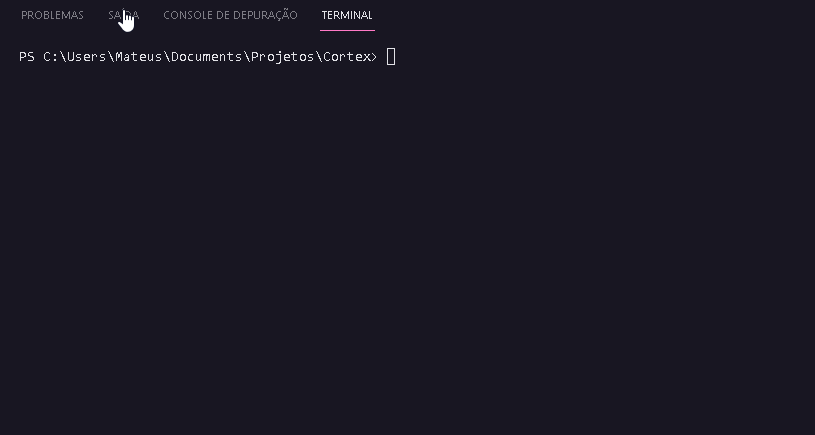
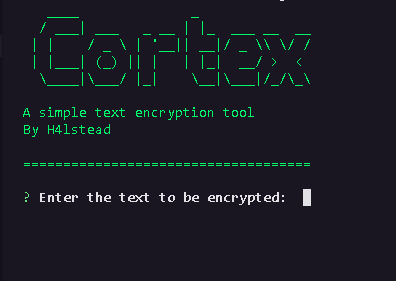
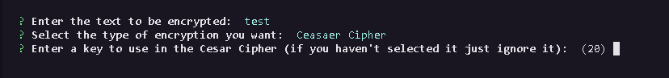

# Cortex
A simple text encryption tool

##Dependencies
- [chalk](https://www.npmjs.com/package/chalk/v/2.4.2)
- [inquirer](https://www.npmjs.com/package/inquirer)

##How to use?
- First, type the text you want to encrypt

  
- Then select the type of encryption you want

  
- And finally, if you selected the cesar cipher, type a key to be used or leave with nothing to use the pattern that is set to 20

  

